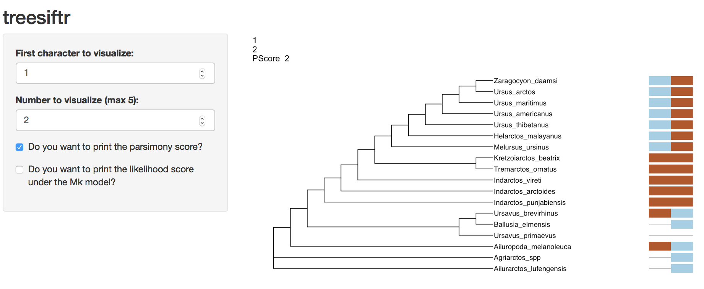
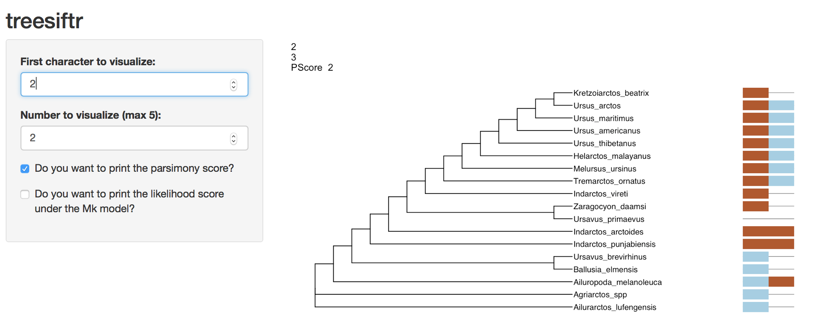
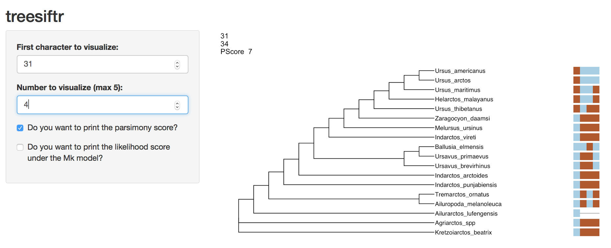

# Introduction

treesiftr is an R package [@R] for visualizing the relationship between phylogenetic 
trees and phylogenetic data. Phylogenetic trees are crucial to the study of 
comparative biology, taxonomy, and evolution. However, understanding how to read 
a phylogenetic tree, and how a phylogenetic tree relates to underlying 
phylogenetic data, remains challenging.

# How to Use the Instructor's Guide

treesiftr has two modes. The first is a graphical user interface (GUI). Exercise 
01-treesiftr is meant to be used with the graphical interface. The second is the RStudio interface. 02-treesiftr-advanced is meant to be used in RStudio, with 
executeable code blocks.

The first part of the instructor guide concerns the use of the GUI. The second part
explains the RStudio interface, with worked examples.

> *Tip*
>
> Linked text goes to the glossary. If you see a term you don't recognize, remember
> you can refresh your memory at the bottom of this worksheet!


## 01-treesiftr Instructor's Guide

Navigate to the [treesiftr application](https://wrightaprilm.shinyapps.io/treesiftr_app/).

treesiftr works by subsetting a phylogenetic matrix using the `start` 
and `step` arguments. These are found on the left-hand side of the screen.
The `start` argument controls where in the matrix you would like to begin visualizing characters. For example, a start value of 1 would indicate to begin visualizing characters from the first character in the matrix. The `step` value indicates how 
many characters at once to visualize. A step value of three would indicate characters 
should be viewed in threes. For example, if `start` = 1 and step = `3`, the visualization will show characters 1, 2, and 3. The start and end points of character visualizations are noted in the upper left-hand corner of the visualization.

There are also two checkboxes. Leave these unchecked until otherwise noted.

treesiftr works by subsetting a phylogenetic matrix by user input. Then, a [parsimony tree](#glossary) is constructed in Phangorn [@Schliep2011, Schliep2017] from the user-defined subset. The tree is [scored](#glossary) under both parsimony and Lewis' Mk model [@Lewis2001] for discrete character data. The data and tree are then visualized using ggtree [@ggtree], based upon the ggplot2 package [@ggplot2]. This application makes use of Shiny to provide a graphical interface, but there is a second included tutorial for more experienced users of the R statistical language.

## Parsimony Questions

1. Visualize characters 1 and 2. What is the parsimony score for this character set? Click "Do you want to print the [parsimony score?](#glossary)" in the interface to check your answer.

> _Instructor's Note:_ The answer is two, as viewed in the below screenshot.



2. Visualize characters 2 and 3. What [monophyletic](#glossary) group from tree 1 is no longer on this tree? 

> _Instructor's Note:_ The answer is _Ursavus brevirhinus_, _Ballusia elmensis_,
> and _Ursavus primaevus_. _Ursavus primaevus_ is no longer sister to _Ursavus     
> brevirhinus_ and _Ballusia elmensis_ on the tree of character 2-3. Sample output 
> follows.




3. What is the parsimony score of the 31-34 character set? Click "Do you want to print the parsimony score?" in the infterface to check your answer.
 
> _Instructor's Note:_ The answer is 7. The output you should see is below.


4. Which character, 8, 9 or 10, represents a [reversal](#glossary)? 

> _Instructor's Note:_ The root of the tree likely blue, with a change to brown on 
the branch leading to _Tremarctos_, _Melursus_, _Helarctos_, and _Ursus_.
_Ursus thibetanus_ posesses the ancestral blue state, and is the best candidate for
reversal.


5. What information would we need to decide if the "1" state possesed by _Zaragocyon_daamsi_  in character 52 is an [autapomorphy](#glossary)? 

> _Instructor's Note:_ To make this decision, we would want to know if there are other
> bears that are not sampled on this tree that posess this character. 

6. Click the switch that says "Do you want to print the likelihood score under the Mk model?" _and_ the switch that says "Do you want to print the parsimony score?". Do all characters with the same parsimony score have the same likelihood score? 

> _Instructor's Notes:_ It is possible for characters with the same number of parsimony  steps to have different likelihood scores.

7. Compare characters 46-49 and 47-50. Why does set 47-50 have a better likelihood than 46-49? 

> Instructor's Notes: Answers may vary. But generally, a character (character 46)
 that implies changes on a fairly short branch is replaced with one implying changes on longer branches.

8. What is the relationship between the likelihood score and increasing the number of characters visualized? 

> Instructor's Notes: The likelihood should become more negative (less likely)

9. What is the minimum number adding a character can add to the parsimony score?

> Instructor's Notes: 1

10. These trees are fully resolved. Based on your exploration of the data, does this degree of resolution make sense?

> Instructor's Notes: For some trees, we can see that there is _no_ character data
supporting the grouping. Parsimony software generally displays fully-resolved trees - 
this may be misleading if little to no data support the grouping!

# 02-treesiftr-advanced Instructor's Guide

> _Instructor's Note:_ A sample slide deck for more advanced audiences is included
> in the folder `inst/slides`. This slide deck is meant to be viewed in RStudio, 
> as it has executeable code blocks. Hoever, it is also included in HTML format,
> if this is desireable for presentation. This is simply included as a sample of how    one might choose to deliver a lecture to cover some of the phylogenetic terms in
> this activity. _It is not necessary to us this lecture to make use of this activity!_

treesiftr works by subsetting a phylogenetic matrix using the `start`, `stop` 
and `step` arguments. The `start` argument controls where in the matrix you 
would like to begin visualizing characters. For example, a start value of 1 would indicate to begin visualizing characters from the first character in the matrix. 
The `stop` value indicates what will be the first character in the last 
visualization. A stop value of 10 would indicate that the first character in the 
last visualization should be character 10. The `step` value indicates how many characters at once to visualize. A step value of three would indicate characters 
should be viewed in threes. For example, if `start` = 1, `stop` = 10, and 
step = `3`, 10 visualizations will be produced. The first will visualize 
characters 1, 2, and 3. The final will be characters 10, 11, and 12. 

A [maximum parsimony](#glossary) tree is then estimated from each dataset. The 
tree is [scored](#glossary) under both parsimony and Lewis' Mk model [@Lewis2001] 
for discrete character data. The data and tree are then visualized using ggtree, based upon the ggplot2 package. This application makes use of Shiny to provide a graphical interface, but in this tutorial, we will use the R Studio interface to visualize our data.

## Installation

Currently, treesiftr can be installed via the devtools ```install_github```
function. treesiftr has a number of required packages. Install and load the below. 

> _Instructor's Note_: This does not auto-execute in the instructor's guide.
```{r setup, message=FALSE}
devtools::install_github("wrightaprilm/treesiftr")
library(treesiftr)
library(phangorn)
library(alignfigR)
library(ggtree)
library(ggplot2)
```

## Subsetting the phylogenetic matrix

The first step to making a treesiftr visualization is to select the subset of 
the phylogenetic matrix that we would like to visualize. This is performed via a function called ```generate_sliding```. The below command will subset the  

```{r} 
# Locate package data and read alignment 
fdir <- system.file("extdata", package = "treesiftr") 
aln_path <- file.path(fdir, "bears_fasta.fa")
bears <- read_alignment(aln_path)
# Read in a starting phylogenetic tree
tree <- read.tree(file.path(fdir, "starting_tree.tre"))

# Generate our list of dataframe subsets
sample_df <- generate_sliding(bears, start_char = 1, stop_char = 5, steps = 1)
```

The result of this is a dataframe, shown below:

```{r}
sample_df
```
This dataframe dispays the start character (the first character that will be visualized) and stop character (the final character that will be visualized). 

We can then build trees from each subset:

```{r message=FALSE,  warning=FALSE}
output_vector <- generate_tree_vis(sample_df = sample_df, alignment =                                                     aln_path, tree = tree, phy_mat = bears)
```

The above code saves the trees to a vector, but does not visualize them. They can
be viauslized by naming the vector, like so:

```{r}
output_vector 
```

`Phangorn` [@Schliep2011, Schliep2017] requires a starting tree to estimate a parsimony tree. We specify the tree we read in earlier for this purpose. The trees, which were generated with `ggtree` [@ggtree] have been saved to a vector, which can be displayed in its entirety, or subsetted to look at specific trees.

## Questions

1. Visualize characters 1 and 2. What is the parsimony score for this character 
set? Once you have answered this question,check your answer by adding the 
parismony score using the `pscore` argument:

```{r message=FALSE, warning=FALSE}
output_vector <- generate_tree_vis(sample_df = sample_df, alignment =                                                     aln_path, tree = tree, phy_mat = bears,
                                   pscore = TRUE)
output_vector
```

> _Instructor's Note:_ The answer is two, as viewed in the first visualization in
the vector.

2. Visualize characters 2 and 3. What [monophyletic](#glossary) group from the tree of 
characters 1 and 2 is no longer on this tree? 

> _Instructor's Note:_ The answer is _Ursavus brevirhinus_, _Ballusia elmensis_,
> and _Ursavus primaevus_. _Ursavus primaevus_ is no longer sister to _Ursavus      brevirhinus_ and _Ballusia elmensis_ on the tree of character 2-3.

3. What is the parsimony score of the 31-34 character set? 
 
> _Instructor's Note:_ The answer is 7. This can be checked like so:

```{r message=FALSE, warning=FALSE}
sample_df <- generate_sliding(bears, start_char = 31, stop_char = 32, steps = 3)

output_vector <- generate_tree_vis(sample_df = sample_df, alignment =                                                     aln_path, tree = tree, phy_mat = bears,
                                   pscore = TRUE)
output_vector[1]
```
 
4. Which character, 8, 9 or 10, represents a [reversal](#glossary) from a [derived](#glossary) state to [ancestral](#glossary)?

> _Instructor's Note:_ The root of the tree likely blue, with a change to brown on 
the branch leading to _Tremarctos_, _Melursus_, _Helarctos_, and _Ursus_.
_Ursus thibetanus_ posesses the ancestral blue state, and is the best candidate for
reversal.
This can be verified like so:
```{r message=FALSE, warning=FALSE}
sample_df <- generate_sliding(bears, start_char = 8, stop_char = 9, steps = 2)

output_vector <- generate_tree_vis(sample_df = sample_df, alignment =                                                     aln_path, tree = tree, phy_mat = bears,
                                   pscore = TRUE)
output_vector[1]
```

5. What information would we need to decide if the "1" state possesed by _Zaragocyon_daamsi_ in character 52 is an [autapomorphy](#glossary)? 

> _Instructor's Note:_ To make this decision, we would want to know if there are other
> bears that are not sampled on this tree that posess this character. We can view
> the tree like so:

```{r message=FALSE, warning=FALSE}
sample_df <- generate_sliding(bears, start_char = 52, stop_char = 53, steps = 1)

output_vector <- generate_tree_vis(sample_df = sample_df, alignment =                                                     aln_path, tree = tree, phy_mat = bears,
                                   pscore = TRUE)
output_vector[1]
```

6.  Do all characters with the same parsimony score have the same likelihood 
score? You can add the likelihood score to the visualization using the below 
code:

```{r message=FALSE,  warning=FALSE}
output_vector <- generate_tree_vis(sample_df = sample_df, alignment =                                                     aln_path, tree = tree, phy_mat = bears, 
                                   pscore = TRUE, lscore = TRUE)
output_vector
```

 
 > _Instructor's Notes:_ It is possible for characters with the same number of 
 > parsimony  steps to have different likelihood scores.

7. Compare characters 46-49 and 47-50. Why does set 47-50 have a better 
likelihood than 46-49? 

> Instructor's Notes: Answers may vary. But generally, a character (character 46)
 that implies changes on a fairly short branch is replaced with one implying changes on longer branches.
```{r message=FALSE,  warning=FALSE}
sample_df <- generate_sliding(bears, start_char = 46, stop_char = 49, steps = 3)

output_vector <- generate_tree_vis(sample_df = sample_df, alignment =                                                     aln_path, tree = tree, phy_mat = bears, 
                                   pscore = TRUE, lscore = TRUE)
output_vector
```

8. What is the relationship between the likelihood score and increasing the 
number of characters visualized? 
> Instructor's Notes: The likelihood should become more negative (less likely)

9. What is the minimum number adding a character can add to the parsimony score?

> Instructor's Notes: 1

10. These trees are fully resolved. Based on your exploration of the data, does 
this degree of resolution make sense?

> Instructor's Notes: For some trees, we can see that there is _no_ character data
supporting the grouping. Parsimony software generally displays fully-resolved trees - 
this may be misleading if little to no data support the grouping!

## Glossary

_Ancestral State_: A character state possessed by the ancestor of a group

_Autapomorphy_: A character state that is unique to a specific taxon.

_Derived State_: A character state that is different from the ancestral state.

_Likelihood Score_: The likelihood of the observed data under a specific 
model.

_Maximum likelihood_: A phylogenetic optimatlity criterion under which phylogenetic
data are modeled according to sets of assumptions. Under this criterion, the tree
that has the best ("maximum") likelihood score under the assumed model is to be preferred.

_Maximum parsimony_: A phylogenetic optimality criterion. This criterion holds 
that the tree implying the fewest changes in the characters used to generate it
should be preferred.

_Monophyletic_: A group on a phylogeny of an ancestor and all of its descendents.

_Parsimony Score_: The number of changes implied by a character on a tree.

_Reversal_: A change from the derived state back to the ancestral state.

## References

